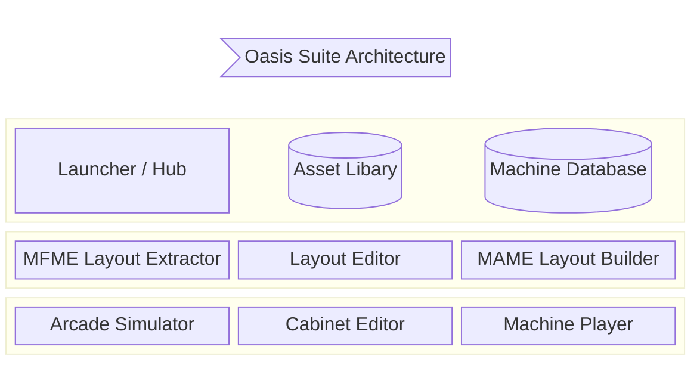

```mermaid
gantt
    title Oasis Components
    dateFormat X
    axisFormat %s
    section Project
    Launcher/Hub : 2, 3        
    section Data
    Machine Database : 4, 5    
    Asset Library : 4, 6    
    section Layout
    MFME Layout Extractor : 0, 2    
    Layout Editor : 1, 7    
    MAME Layout Builder : 2, 3     
    section 3d
    Cabinet Editor : 3, 5    
    Machine Player : 4, 6    
    Arcade Simulator : 5, 8    
```

# Architecture
<!-- Mermaid diagram tools/info:
    https://docs.github.com/en/get-started/writing-on-github/working-with-advanced-formatting/creating-diagrams
    https://mermaid.js.org/intro/
    And a live editor for quick testing here: https://mermaid.live/
-->

# Roadmaps

## Overall

## Machine Database

## Asset Library

```mermaid
gantt
    title TODO Asset Library elements
    dateFormat X
    axisFormat %s
    section TODO
    TODO : 2, 3        
    section TODO
    TODO : 3, 5    
    TODO : 4, 6    
    TODO : 5, 8    
```

## MFME Layout Extractor

## Layout Editor

## MAME Layout Builder

```mermaid
gantt
    title TODO MAME Layout Builder elements
    dateFormat X
    axisFormat %s
    section TODO
    TODO : 2, 3        
    section TODO
    TODO : 3, 5    
    TODO : 4, 6    
    TODO : 5, 8    
```

## Cabinet Editor

```mermaid
gantt
    title TODO Cabinet Editor elements
    dateFormat X
    axisFormat %s
    section TODO
    TODO : 2, 3        
    section TODO
    TODO : 3, 5    
    TODO : 4, 6    
    TODO : 5, 8    
```

## Machine Player

## Arcade Simulator

```mermaid
gantt
    title TODO Arcade Simulator elements
    dateFormat X
    axisFormat %s
    section TODO
    TODO : 2, 3        
    section TODO
    TODO : 3, 5    
    TODO : 4, 6    
    TODO : 5, 8    
```

# Todo/In Progress/Done tasks/features
All issues are currently being tracked on a private Jira server for developer convenience.  A way may be found to share a live public view of this in future.

# Unity technical details
Unity version is 2021 LTS (2021.3.15f1 LTS at the time of writing), as the Arcade Simulator project is built on 2021.2.7f1. The plan is to switch to 2023 LTS when that is released in Q4 2024, as well as general improvements, this will allow for removal of the Unity splashscreen delay when starting the various programs that make up the Oasis suite.

We are using Built-in Render Pipeline, this is due to lightmap baking being impractical for user-created environments (Arcades, Crazy Golf courses, race tracks etc)... all Unity runtime-lightmap baking solutions seemed lacking (on device, remote lightmap baking server etc), and by the time this is a mature product, RTX cards may be relatively standard and affordable, meaning dynamic light/shadows with no baked maps required.
